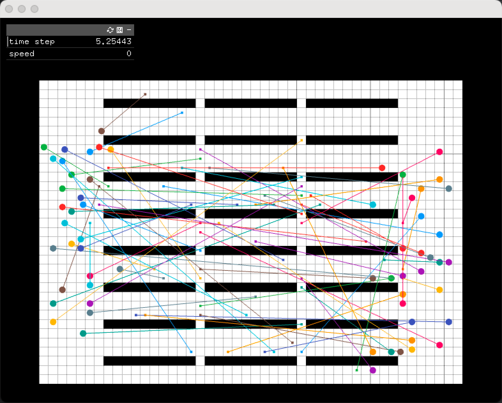

# RHCR


[RHCR](https://github.com/Jiaoyang-Li/RHCR) modified to support very large environments through the use of a tweaked version of [LaCAM 3](https://github.com/Kei18/lacam3).

This forked repository is only for TSI class purposes for multiagents understanding

## Requirements
* [boost](https://www.boost.org/)

## Build
Clone with submodules
```
git clone https://github.com/JustinShetty/lacam3
```

then run the build script
```
./build.sh
```

## building mapf-visualizer

To install mapf-visualizer please follow this instructions

https://github.com/Kei18/mapf-visualizer


After having built the RHCR and installed the mapf-visualizer.
To run one of the article https://arxiv.org/pdf/2005.07371v2 results follow the next commands

```sh
./lifelong -m maps/kiva.map -k 60 --scenario=KIVA --simulation_window=1 --solver=ECBS --suboptimal_bound=1.5 --dummy_path=1 --seed=0 --simulation_time=500
```

The file 'paths_lacam_format.txt' will be created in the folder exp/test/

Then you can run

```sh
mapf-visualizer maps/kiva-lacam.map exp/test/paths_lacam_format.txt
```

You will see a visualizer like this



## License
RHCR is released under USC – Research License. See [license.md](license.md) for further details.
